# anvil

Toolkit de skills para Claude Code. Sucede o [mosk](https://github.com/rogerznts/mosk),
trocando agentes-como-persona por um conjunto curado de skills de terceiros.

**O anvil não escreve as próprias skills de trabalho.** Ele curadoriza 35 skills
de cinco repositórios upstream, mantidos como submodules em `references/`, e as
vendoriza com adaptação registrada num manifesto — de forma que continuem
atualizáveis quando o upstream andar.

```bash
npx degit rogerznts/anvil/anvil . --force
```

depois

```bash
claude
> /anvil-boot
```

O `--force` é necessário em projeto que já existe: o degit recusa diretório
não-vazio. Ele sobrescreve arquivo a arquivo e **não apaga** nada que já estava
lá — o `README.md` e o código do projeto passam intactos. Em diretório vazio o
`--force` é dispensável.

---

## A regra que governa tudo

> Tudo funciona no padrão das skills originais. A única coisa que o anvil impõe é
> **onde** o arquivo é salvo dentro de `docs/`. Bateu dúvida, o padrão é o da
> skill original.

Isso é possível porque as skills do Matt Pocock não têm caminho fixo: elas leem
`docs/agents/issue-tracker.md`, um documento do projeto. **A organização
documental do anvil é um perfil de tracker** — ao lado de github, gitlab e local
— e não um alvo de reescrita.

O resultado, medido em 2026-09-13 com
`bash .claude/skills/anvil-sync/scripts/vendor-sync.sh stats`:

| | |
|---|---|
| skills `vendored` no manifesto | 36 entradas: as 35 skills curadas e o `anvil-bench`, autoral, que traz o `unlazy`. 34 têm árvore no upstream; `anvil-principles` e `anvil-bench` são só `keep` e `extra` |
| linhas dos arquivos que existem no pin e no payload | 21.887 |
| **linhas nossas que diferem do upstream** | **202 — 0,92%** |
| arquivos deixados de fora (`strip`) | 59 |
| arquivos do anvil dentro de skill vendorizada (`keep`) | 35 arquivos · 7.866 linhas |
| material trazido de fora da árvore da skill (`extra`, inclui o `unlazy` do bench) | 45 arquivos · 5.771 linhas · 4 nossas |
| arquivo sem par, fora da conta | 0 |

*Linha nossa* é a que está no payload e não está na versão do pin. A definição
inteira, com o que conta à parte, está no próprio script.

Em dezessete dessas skills, os arquivos pareados têm **uma linha** de delta: o
`name:` do frontmatter. O que conta à parte fica fora dessa linha — o
`anvil-stack-payload` está entre as dezessete e carrega 29 arquivos `keep`.

---

## O fluxo, num projeto novo

```mermaid
flowchart TD
    A["npx degit rogerznts/anvil/anvil . --force"] --> B["/anvil-boot"]

    subgraph boot ["Boot — uma vez por projeto"]
        direction TB
        B --> B1["CLAUDE.md<br/>bloco ANVIL:DIRECTIVES"]
        B1 --> B2["varre o projeto"]
        B2 --> B3[".claude/rules/<br/>project.md · anvil.md"]
        B3 --> B4["anvil-docs, sem verbo<br/>escolhe scaffold ou adopt<br/>architecture · discovery<br/>specs · agents"]
        B4 --> B5["anvil-setup<br/>docs/agents/issue-tracker.md"]
        B5 --> B6{"achou<br/>payload.config.ts?"}
        B6 -->|sim| B7["propõe rules/payload.md<br/>e espera aprovação"]
        B6 -->|não| B8
        B7 --> B8["registra o hook de merge<br/>e confirma que dispara"]
    end

    B8 --> C["/anvil-grill"]

    subgraph janela ["Uma janela de contexto só — não compactar"]
        direction TB
        C -->|"context.md + ADRs"| D["/anvil-to-spec"]
        D -->|"new-spec.sh reserva 012 no origin<br/>docs/specs/012-feature-cupom/spec.md"| E["/anvil-to-tickets"]
        E -->|"issues/01…NN.md<br/>Blocked by · Status"| F["/clear"]
    end

    F --> G["/anvil-implement<br/>um ticket por vez"]
    G -->|"chama por dentro"| H["/anvil-tdd"]
    H --> I["/anvil-code-review<br/>Standards + Spec"]
    I --> J{"todos os tickets<br/>Status: resolved?"}
    J -->|não| G
    J -->|sim| P["/anvil-docs archive<br/>promove ADR · move p/ archive/"]
    P --> K["/tea-open-pr<br/>UM PR por spec"]
    K --> L{"hook: issues/ fechados<br/>e spec arquivada?"}
    L -->|"ticket aberto ou<br/>spec não arquivada"| M["bloqueia · exit 2"]
    L -->|sim| N["PR aberto<br/>corpo lista a spec e os tickets<br/>cada ticket ganha a URL de volta"]
    N --> O["merge<br/>a spec já chega arquivada"]

    style boot fill:#f8f8f6,stroke:#bbb
    style janela fill:#f8f8f6,stroke:#bbb
    style M fill:#fdecea,stroke:#c33
    style P fill:#eaf6ec,stroke:#3a3
    style O fill:#eaf6ec,stroke:#3a3
```



O `grill → to-spec → to-tickets` roda numa **janela só**, sem compactar. É o que
o fluxo do Matt exige, e é o que faz o encadeamento funcionar sem estado em
disco. Depois cada `implement` começa do zero, e **o ticket é o estado**:
`Blocked by` carrega a ordem, `Status` carrega o progresso.

**O `archive` vem antes do PR, não depois do merge.** Promover o ADR e mover a
spec são mudança em arquivo, e depois do merge não sobra branch onde commitar —
seria um segundo PR só para mover pasta, com a spec parada no branch padrão sem
arquivar no intervalo. Antes do PR, o move entra no mesmo diff que vai ser
revisado, e a guarda de merge impõe a ordem.

**Nenhuma skill do fluxo sabe o que é `docs/specs/`.** Todas leem o perfil.

---

## As skills

### Fluxo principal — da ideia ao merge

| skill | para quê | origem |
|---|---|---|
| `anvil-grill` | entrevista que afia o plano e **escreve enquanto decide**: glossário, ADRs, e o fluxo de usuário em `specs/{id}/ui/` | mattpocock |
| `anvil-to-spec` | transforma a conversa em spec, sem entrevistar de novo | mattpocock |
| `anvil-to-tickets` | corta a spec em tickets *tracer bullet*, cada um declarando o que o bloqueia | mattpocock |
| `anvil-implement` | constrói a partir do ticket; chama `tdd` e `code-review` por dentro | mattpocock |
| `anvil-code-review` | revisa o diff em dois eixos independentes — Standards e Spec | mattpocock |
| `anvil-tdd` | ciclo vermelho-verde que produz teste que se mantém, em seams acordados | mattpocock |

### Entender antes de mudar

| skill | para quê | origem |
|---|---|---|
| `anvil-how` | *"como X funciona?"* — passeio pelo código, camadas, onde uma coisa deveria morar | pstack |
| `anvil-research` | investiga contra fonte primária e devolve um documento com citação por afirmação | mattpocock |
| `anvil-distill` | destila uma funcionalidade de um sistema de referência em `references/`: ponteiros `caminho:linha`, tradução para a stack do projeto e o que não portar | autoral |
| `anvil-diagnose` | bug difícil: constrói o loop de feedback antes de levantar hipótese | mattpocock |
| `anvil-domain-modeling` | constrói o glossário e os ADRs; a linguagem ubíqua do projeto | mattpocock |
| `anvil-codebase-design` | vocabulário de módulo profundo, seam, interface, alavanca | mattpocock |

### Decidir a forma

| skill | para quê | origem |
|---|---|---|
| `anvil-architect` | esboça tipos, assinaturas e módulos **antes** do código, e fica no loop | pstack |
| `anvil-arena` | N candidatos em paralelo, um juiz independente, enxerta o melhor de cada | pstack |
| `anvil-prototype` | protótipo descartável para responder uma pergunta de design que só se responde vendo rodar. A decisão volta para o documento; o protótipo morre fora da main | mattpocock |
| `anvil-wayfinder` | trabalho grande demais para uma sessão: mapa de tickets de decisão | mattpocock |
| `anvil-principles` | os 21 princípios que `poteto`, `architect` e `arena` citam | pstack |
| `anvil-poteto` | modo de trabalho: todolist, playbook por formato de tarefa, prosa sem gordura | pstack |

### Interface

O `anvil-ui` é **roteador**: escolhe um método e só um, porque `hallmark` e
`taste` são rivais — um manda emitir OKLCH próprio, o outro proíbe escrever CSS
quando existe pacote oficial.

| skill | para quê | origem |
|---|---|---|
| `anvil-ui` | decide qual método usar antes de qualquer código | autoral |
| `anvil-ui-hallmark` | 21 macroestruturas, 20 temas, 58 portas anti-slop, e o verbo `study` que extrai DNA de uma referência | hallmark |
| `anvil-ui-taste` | 3 dials numéricos e roteamento para design system oficial | taste |
| `anvil-ui-redesign` | audit-first sobre código existente | taste |
| `anvil-ui-brutalist` | preset: industrial, terminal CRT, tipografia suíça | taste |
| `anvil-ui-minimalist` | preset: editorial contido, monocromático quente, bento plano | taste |
| `anvil-ui-soft` | preset: acabamento de agência — fontes, espaçamento, sombras, cartões | taste |
| `anvil-ui-stitch` | preset: gera `DESIGN.md` semântico para o Google Stitch | taste |

Preset é **tema, não processo** — aplicado por cima do método, nunca no lugar dele.

### Escrita e comunicação

| skill | para quê | origem |
|---|---|---|
| `anvil-unslop` | corta os tiques de LLM de qualquer texto. Vale sempre | pstack |
| `anvil-writing-for-agents` | escrever documento que um agente vai ler: divulgação progressiva, ponteiro de contexto | mattpocock |
| `anvil-wait-what` | *"essa mensagem não chegou — reformule"* | mattpocock |
| `anvil-grill-me` | a entrevista sem diretório de trabalho | mattpocock |
| `anvil-grilling` | a primitiva de entrevista que `grill`, `grill-me` e `wayfinder` chamam | mattpocock |
| `anvil-to-questionnaire` | vira o que você não sabe responder num questionário para outra pessoa | mattpocock |
| `anvil-teach` | ensina um conceito, com aulas em HTML e registro de aprendizado | mattpocock |
| `anvil-handoff` | compacta a sessão num documento para outro agente continuar | mattpocock |

### Infraestrutura do toolkit

| skill | para quê | origem |
|---|---|---|
| `anvil-boot` | prepara o projeto: diretivas, rules, `docs/`, tracker, stack, hook, lock | autoral |
| `anvil-update` | reinstala do zero, apagando órfãos pelo `anvil.lock` | autoral |
| `anvil-docs` | onde o documento mora, como a spec se chama, e o que acontece quando fecha | autoral |
| `anvil-setup` | escreve o perfil do issue tracker que o fluxo lê | mattpocock |
| `anvil-wizard` | gera um wizard em bash para o passo que só um humano pode fazer | mattpocock |
| `tea-commit` | commit em Conventional Commits, sem pular hook | autoral |
| `tea-open-pr` · `tea-open-fast-pr` | PR no Gitea, **um por spec**: o corpo lista a spec e seus tickets, e cada ticket ganha a URL do PR de volta | autoral |
| `tea-prune-branches` | remove branch local cujo remoto sumiu | autoral |

### Stack e bench

| skill | para quê | origem |
|---|---|---|
| `anvil-stack-payload` | o ofício do Payload em 11 arquivos, mais a `RULE.md` com as quatro ciladas | payloadcms |
| `anvil-bench` | leva quem não programa de uma necessidade até a ferramenta rodando | autoral + `unlazy` |

O bench é autoral, mas carrega material de terceiro embaixo de `unlazy/`: o
[unlazy](https://github.com/Leonxlnx/unlazy) (MIT), que transforma o critério de
pronto acordado na entrevista num **ledger de gates executável**. O loop do bench
é headless, então o veredito não pode ser leitura de auto-relato — ele é a
reexecução do ledger pelo supervisor, com `gate-check --reverify`.

Ele entra como material, não como skill, porque a `description` do upstream
dispara em *"long or multi-part task"* e se auto-invocaria dentro do
`/anvil-implement`. O que ficou de fora, e por quê, está em
`anvil-bench/unlazy/VENDOR.md` — inclusive o Stop hook, que competiria com o teto
de três tentativas do próprio bench.

---

## Organização documental

O que o anvil impõe é **só a pasta**. O conteúdo dentro dela é integralmente das
skills originais.

```
docs/
├── index.md                       auto-gerado
├── agents/issue-tracker.md     ●  o perfil que o fluxo lê
├── architecture/               ●  context.md · adr/
├── discovery/                  ●  anvil-research
├── specs/                      ●
│   ├── 012-feature-checkout-coupon/     ← só a PASTA é do anvil
│   │   ├── spec.md                        anvil-to-spec, com as User Stories
│   │   ├── issues/01-modelo-de-cupom.md   anvil-to-tickets
│   │   │     **Blocked by:** —
│   │   │     **Status:** resolved
│   │   ├── ui/                            fluxo e comportamento desta mudança
│   │   └── map.md                         anvil-wayfinder, quando usado
│   └── archive/
│
└── prd/  ui/  qa/  project/    ○  reconhecidos, nascem quando houver conteúdo
```

**●** o `scaffold` cria · **○** nenhuma skill escreve; são para o que você
escrever à mão

**Não há skill que autore PRD.** A spec é a unidade e carrega suas próprias User
Stories — o `to-spec` pede uma lista *"extremely extensive"*. Camada de épico
atravessando specs, se você quiser, é escrita à mão em `prd/`.

O **branch** é `{tipo}/{NNN}-{nome}` — string diferente da pasta, de propósito.
Resolva sempre pelo prefixo numérico, nunca por igualdade.

Não há `spec-meta.yaml`, `tasks.md` nem `gate.yaml` no fluxo normal. **O estado é
lido do disco:** `spec.md` existe → especificado; `issues/` com `Status` diferente
de `resolved` → em andamento; pasta sob `archive/` → arquivado.

---

## O que fica versionado

**Tudo.** O que o degit escreve em `.claude/` — skills, agentes e o `anvil.lock` —
entra no repositório do projeto como qualquer outro arquivo. O boot não escreve
bloco no `.gitignore`, não pergunta o que ignorar e não oferece tirar o toolkit do
versionamento.

A razão é a reprodutibilidade: quem clona o repositório tem o toolkit na versão em
que o projeto foi trabalhado, sem rodar instalação nenhuma, e o diff de um
`/anvil-update` é a revisão do que mudou no toolkit — não um buraco no histórico.

| | |
|---|---|
| `.claude/skills/` | as skills instaladas |
| `.claude/agents/` | os agentes instalados, se o payload trouxer algum |
| `.claude/anvil.lock` | o que esta instalação possui, e o que o update usa para calcular órfãos |
| `.claude/rules/` | o contexto que o boot levantou deste projeto |
| `.claude/settings.json` | a configuração, incluindo o hook |
| `docs/` | o trabalho |

Um projeto bootado antes ignorava o toolkit, por um bloco `ANVIL:INSTALLED` ou por
uma linha que cobria `.claude/skills/` inteiro. O boot acha os dois, mostra o antes
e o depois, e **propõe removê-los** para o toolkit voltar a ser versionado. O
`/anvil-update` remove o bloco sozinho na reinstalação, e o relata. Linha parecida
que o boot não escreveu não é tocada.

---

## Vindo do mosk

O boot detecta e **propõe** a migração, esperando aprovação antes de apagar.

| Sai | Fica |
|---|---|
| `.claude/agents/mosk-*.md` — as doze personas | `.claude/rules/` — é do projeto |
| `.claude/mosk/` — 252 arquivos de core | `docs/` — vai para o verbo `adopt` |
| `.claude/skills/mosk-*` | `.claude/settings.json` — o hook é **mesclado** |

No `CLAUDE.md`, o bloco `MOSK:DIRECTIVES` vira `ANVIL:DIRECTIVES`. Os dois não
convivem: as regras de idioma se contradizem — o mosk mandava escrever artefato
em inglês, o anvil manda em pt-BR.

As specs em layout antigo — `spec-meta.yaml`, `tasks.md`, `stories/` — são
convertidas pelo verbo `adopt`, que classifica **lendo o arquivo, nunca o nome**,
e mostra o plano inteiro antes de mover qualquer coisa.

---

## Manutenção da curadoria

Não vai no degit. Vive no repositório do anvil.

```bash
S=.claude/skills/anvil-sync/scripts/vendor-sync.sh

bash $S status          # o que andou upstream desde cada pin
bash $S pull            # atualiza os submodules
bash $S vendor <nome>   # primeira cópia de uma skill
bash $S update [<nome>] # merge 3-way; sem argumento, todas
bash $S verify          # integridade do payload
bash $S stats           # a métrica do topo deste README
```

**O pin do submodule é a base do merge.** Nenhum snapshot é guardado:

```
base   = git -C <submodule> show <pin>:<path>/<arquivo>
theirs = git -C <submodule> show <HEAD>:<path>/<arquivo>
ours   = anvil/.claude/skills/<nome>/<arquivo>
```

O catálogo de adaptações é **fechado**: `rename`, `invocable`, `docs-remap`,
`decursor`, `tracker-profile`, `keep`/`strip`/`extra`. Se uma mudança não cabe em nenhuma, ela não deveria estar
sendo feita. E há uma lista do que **nunca** é adaptação: traduzir, enxugar,
uniformizar vocabulário entre skills, corrigir erro do upstream.

---

## Estrutura do repositório

```
anvil-skills.yaml             manifesto de curadoria      ─┐ não vão
.claude/skills/anvil-sync/    ferramenta de manutenção    ─┘ no degit
references/                   submodules — os pins são a base do merge
  skills/      mattpocock/skills
  plugins/     cursor/plugins (pstack)
  hallmark/    Nutlope/hallmark
  taste/       Leonxlnx/taste-skill
  payload-skills/  payloadcms/skills
  mosk/        rogerznts/mosk (herança)
anvil/                        o payload que o degit copia
docs/                         a documentação do próprio anvil
```

As decisões de arquitetura estão em [`docs/architecture/adr/`](docs/architecture/adr/)
e o plano de construção em [`docs/project/plan.md`](docs/project/plan.md).

## Crédito

O trabalho está nos repositórios upstream. O anvil é curadoria.

[mattpocock/skills](https://github.com/mattpocock/skills) ·
[cursor/plugins](https://github.com/cursor/plugins) ·
[Nutlope/hallmark](https://github.com/Nutlope/hallmark) ·
[Leonxlnx/taste-skill](https://github.com/Leonxlnx/taste-skill) ·
[payloadcms/skills](https://github.com/payloadcms/skills)
