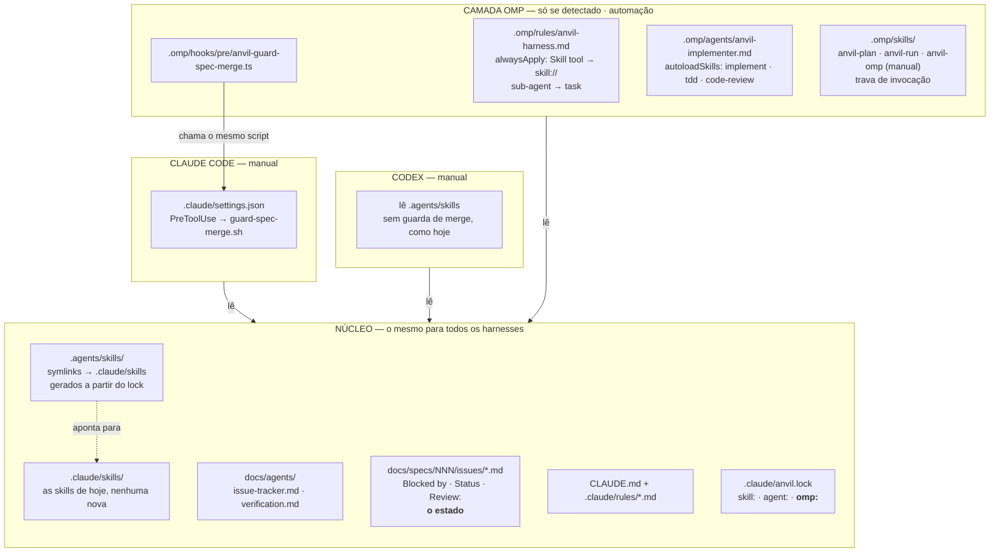
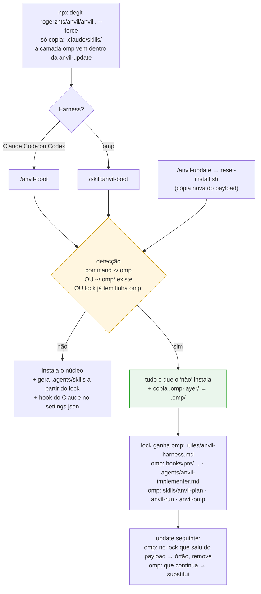
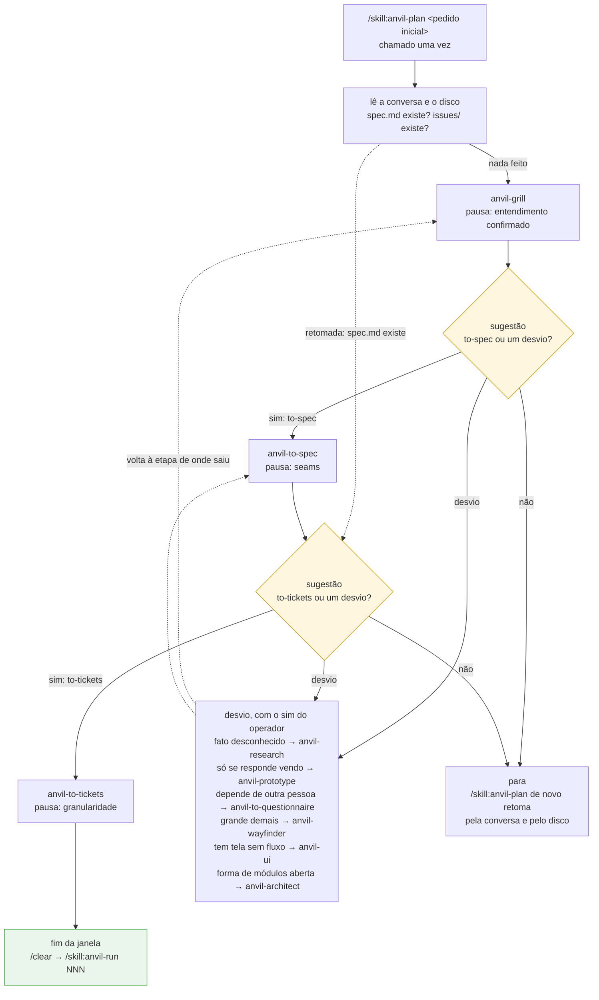
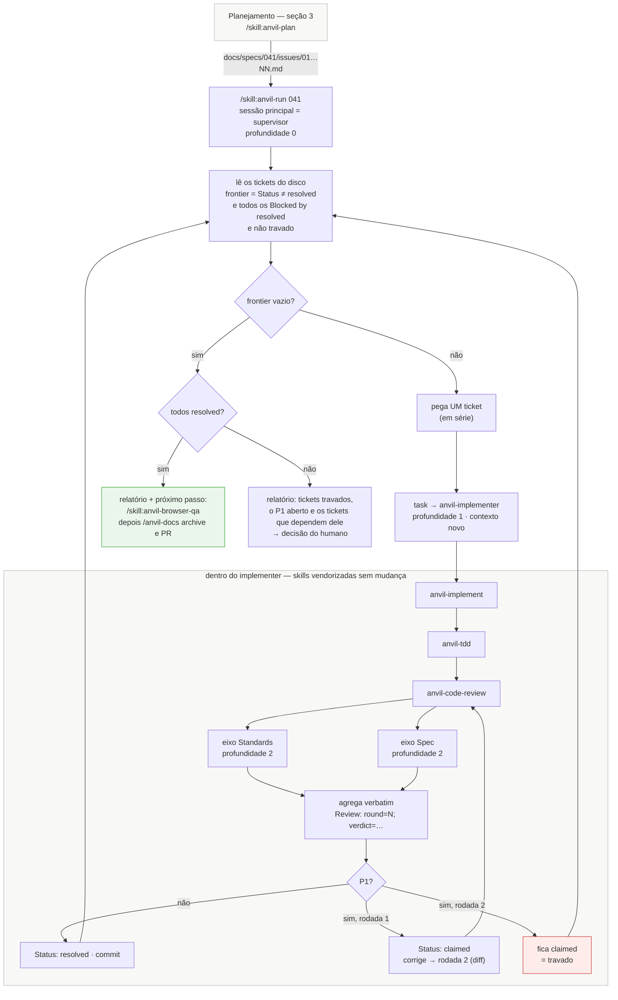
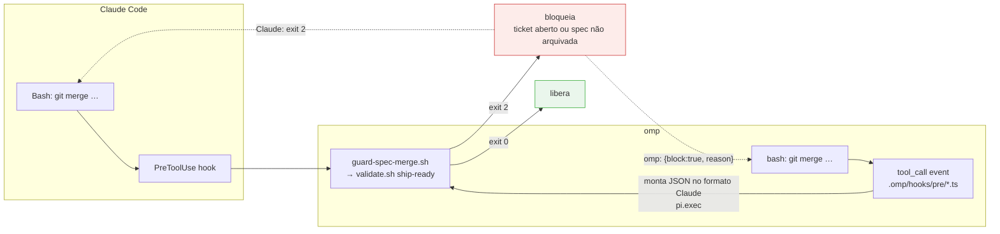

# Camadas do anvil com o omp — desenho do fluxo

Desenho do que o grill de 2026-09-23 decidiu a partir de
[adaptar-omp-ao-anvil.md](./adaptar-omp-ao-anvil.md). A decisão está no
[ADR-0011](../architecture/adr/adr-0011-omp-como-harness-com-camada-propria.md) —
o omp é harness de primeira classe, com camada própria. Nada disto está
implementado ainda.

**A automação só existe no omp.** A condução do planejamento (`anvil-plan`) e a
da implementação (`anvil-run`) moram na camada omp. No Claude Code e no Codex o
fluxo continua manual, como hoje, e a lista de skills que eles veem não muda.

## 1. As camadas e onde cada coisa mora

No payload, a camada omp não mora em `.omp/` nem é skill: viaja como material
dentro da `anvil-update`, em `anvil/.claude/skills/anvil-update/.omp-layer/`.
O boot e o update a copiam para `.omp/` quando o omp é detectado. O espelho
`.agents/skills` deixa de vir pronto no payload: o `reset-install.sh` o gera, um
symlink por linha `skill:` do lock, e remove os órfãos junto. O omp também lê
`.agents/skills`, mas deduplica por caminho real, então os symlinks não viram
duplicata.

## 2. Instalação e update — como a camada chega ao projeto

A detecção é **pegajosa**. Se o dev A tem omp e o dev B não, o update do B
encontra linhas `omp:` no lock e mantém a camada. A ausência do binário nunca
remove nada.

## 3. Planejamento na mesma janela, conduzido pela `anvil-plan` — só no omp

É a ideia do `/anvil-plan` do discovery (l. 88–116, *"automático entre os gates
humanos"*). A skill mora em `.omp/skills/anvil-plan` e tem trava de invocação:
só o operador a chama, uma vez, com `/skill:anvil-plan <pedido inicial>`. Ela
conduz `grill → to-spec → to-tickets` na mesma janela. Entre uma etapa e outra,
faz a sugestão: propõe a próxima etapa ou um desvio, e só carrega com o sim do
operador.

No Claude Code e no Codex continua como hoje: o operador chama `/anvil-grill`,
`/anvil-to-spec` e `/anvil-to-tickets` à mão, na mesma janela.

As etapas e as pausas de cada skill continuam as mesmas. O que entra é o
condutor: o operador não precisa saber a ordem, os nomes nem os desvios, e cada
transição continua sendo decisão dele. A etapa não é guardada em campo nenhum;
sai da conversa e do disco, como manda o
[ADR-0003](../architecture/adr/adr-0003-sem-maquina-de-fases.md). A
`mosk-suggestion` morreu justamente por ler um `current_phase`.

O limite: nenhum harness garante que a instrução de conduzir continue viva numa
conversa longa. Se ela se perder, chamar `/skill:anvil-plan` de novo recupera o
ponto.

Duas diferenças em relação ao discovery: a transição pede sim em vez de ser
automática, e o condutor conhece os desvios, não só a rota principal.

## 4. Uma execução do começo ao fim no omp

No Claude Code e no Codex continua como hoje: um `/anvil-implement` por ticket,
cada um numa sessão nova, com o `/anvil-next` na passagem.

"Travado" não é status novo: é o que se lê da última linha `Review:`, na rodada 2
com `fail`. A terceira rodada é do humano, como manda o
[ADR-0010](../architecture/adr/adr-0010-verificacao-tem-criterio-de-parada.md).
Se o supervisor morrer, basta rodar `/skill:anvil-run 041` de novo: ele recalcula
tudo a partir do disco.

## 5. A guarda de merge

A regra fica numa fonte só, `validate.sh`. O que muda entre os harnesses é só
como o bloqueio volta ao agente. Continua existindo um furo conhecido: um
`git merge` disparado pelo `eval` passa pela guarda. É o mesmo tipo de furo que o
hook do Claude já tem com tudo o que não passa pelo Bash. O Codex segue sem
guarda, como hoje.
